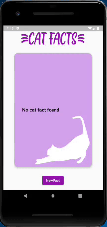

# Cat Facts

A Flutter project done during Raro Academy course, as an extra assignment (LevelUp Extra)

## About the application

This project consists of a page that shows a different cat fact each time a button is pressed.

All the facts information shown in the application are consumed from an API called Cat Facts (link to it on the section "Extra Information").

## To Do
- [ ] Tests on different size screens
- [ ] Tests on iOs devices

## Extra Information
- API [Cat Facts](https://catfact.ninja/)
- Some extra documentation from the API can be found [here](https://documenter.getpostman.com/view/1946054/S11HvKSz)

